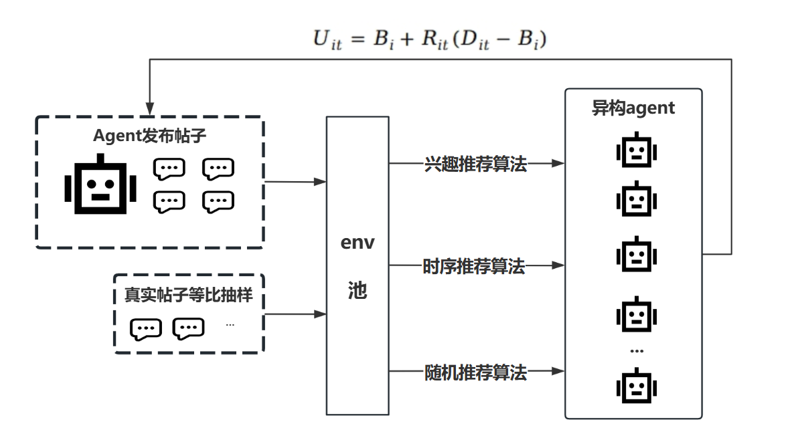
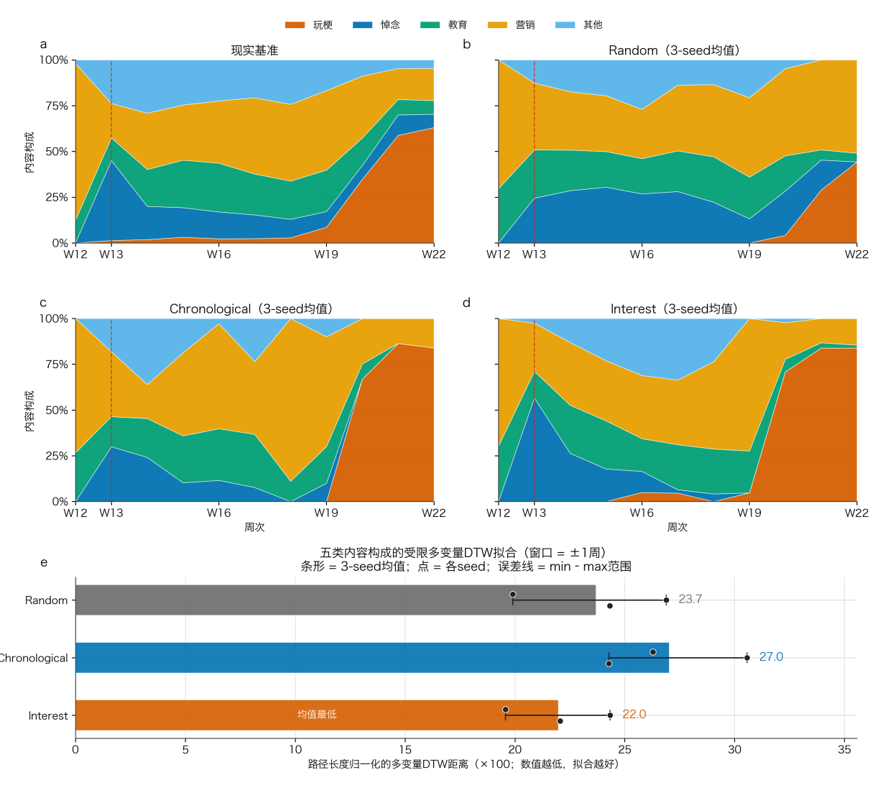
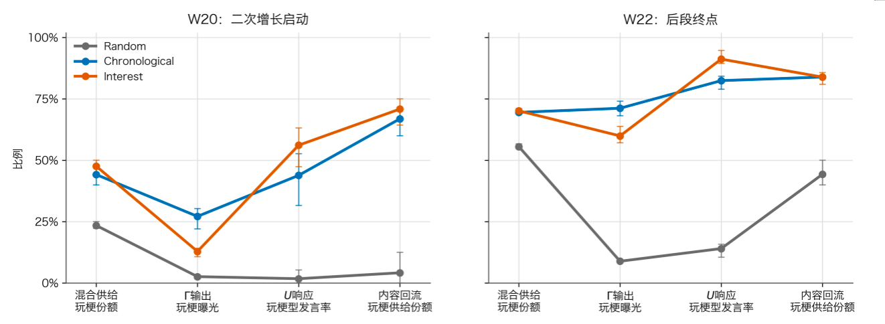
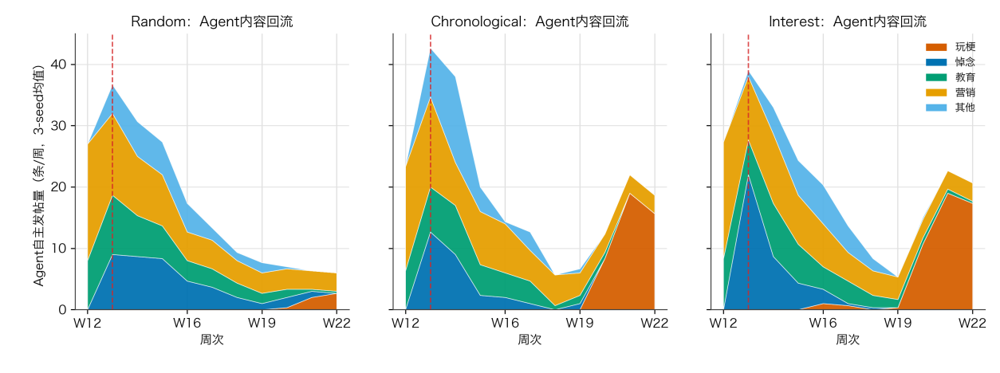

**悼念退潮之后：基于多智能体仿真的逝者数字形象塑造机制研究**

> **修订说明（2026-09-25，未同步至 `source/` DOCX）**：本文本在 v3 接受修订稿基础上，
> 按 `paper/REMEDIATION_PLAN.md` 完成三项诚信性修订：(1) 全文"人工编码/人工标注"改为
> "大语言模型辅助编码"，并新增第二章（四）报告跨模型一致性与测量不确定性；
> (2) 撤销"兴趣制度拟合最优"这一对编码来源不稳健的制度比较结论（见第二章（四）与第四章（一））；
> (3) 类别份额量级一律按编码轮与平台构成区间报告，并收窄"玩梗已成为主导性公共表征"
> 与未经评估的治理效果表述；(4) 新增对 1904 条智能体生成帖的**盲法判类审计**
> （独立模型、不看身份/制度/周次、不用词表），身份与文本判类 κ = 0.822、轨迹几乎重合，
> 据此把"表征转移"主张保留在文本证据上，并移除环境四词表复核这一无效诊断。
> `source/v3_*.docx|pdf` 为修订前版本，请勿混用。
>
> **修订说明（2026-09-26，未同步至 `source/` DOCX）**：新增第四轮独立重打标
> （DeepSeek-V4.1，与主标签同属 DeepSeek 家族）并据此更新第二章（四）：原报告的
> 三轮一致性数字系由 GLM 轮**未跑完**时的中间产物算出，本轮已用终版 GLM 成品重算并
> 一并更正（DeepSeek–GLM 类别一致率 59.5%→60.7%、κ 0.497→0.511；doubao-seed–GLM
> 72.6%→74.0%、κ 0.650→0.668；梗文化占比 9.7%→10.4%）。同族复现显示原标为离群者，
> 正文相应收紧了"原标偏离不可归因于模型族特性"这一表述。标注器敏感性、平台异质性与
> 平台构成标准化三项分析均已按四个标注轮重算（`hypothesis_4/experiment_1/results/`）。
>
> **修订说明（2026-09-26 二次修订，未同步至 `source/` DOCX）**：经复核各轮打标脚本，
> 发现上条"原标偏离是该轮判定本身的系统性偏移"归因证据不足，已改写第二章（四）：
> (1) 四轮编码配置并不一致——第一轮"判定依据"中位 11 字（99.5% ≤20 字），后三轮
> 27—34 字（≤20 字仅 3.6%—12.7%），输出端签名呈类别式差异，表明第一轮提示词与后三轮
> 不同；(2) 分歧集中于"教育观点讨论"边界且
> 双向（原标其他/借势/悼念各有 2458/2055/733 条被后三轮一致改判为教育观点讨论；
> 反向 1214 条，其中 886 条被判借势营销）；(3) 因此把跨模型一致性证据限定于判定标准
> 逐字相同的后三轮（κ = 0.668—0.767），原标参与的三对 κ（0.430—0.511）同时含口径
> 差异，降级为参考上界。复核脚本：`data/scripts/prompt_provenance_check.py`（只读）。
>
> **修订说明（2026-09-26 三次修订，未同步至 `source/` DOCX）**：二次修订中"第一轮提示词
> 未留存、无法复原"的说法已不成立——第 1 轮（原标）的打标提示词已从本机历史 Workflow
> 脚本中恢复，全文、来源与指纹见 `data/prompts/label_prompt_round1.md`，恢复脚本为
> `data/scripts/prompt_provenance_check.py` §A2（含输出端签名交叉验证：该轮 52,736 条"判定依据"最长
> 29 字、100% ≤30 字，与恢复出的提示词中 `"reason":"≤30字判定依据"` 逐字对应）。
> 恢复后可确证第一轮与后三轮的口径差异有四类：(a) 类别定义为本事件特化（直接写入
> 雪碧梗、巧乐兹梗、"牢张"、天地银行等专名与人物背景），后三轮为不含专名的通用定义；
> (b) 判定核心为"张雪峰在句中扮演什么角色"并附"把'张雪峰'三字拿掉"的辅助判别法，
> 后三轮为六步顺序判定；(c) "判定依据"硬约束为 ≤30 字，后三轮为"1-2 句话"；
> (d) 有效性与类别强制耦合（无效→借势营销/爬取噪音，有效→其余四类），且"存疑"是
> 一个类别，后三轮两者相互独立且无"存疑"类别。此外还有两类非提示词差异：第一轮子代理
> 可见 `match_sentence`（关键词命中句）与部分行的 `ctx_full_content`，后三轮只喂
> `title`+`content`；第一轮为 agentic 流程（子代理用 Read/Write 工具，每批 150 行），
> 后三轮为 API 调用（逐条或每 8 条一次）。差异清单见 `data/prompts/label_prompt_round1.md` §C。
> 该恢复**不改变**二次修订的归因结论：口径差异的具体内容现已可枚举，但其量级仍无法
> 与判定质量差异分离（须以第一轮提示词重跑方能定量），故正文仍不将原标偏离归因于
> 模型的判定能力。

**摘要：**社交平台中的公众人物逝后形象并非对其生前经历的静态再现，而是在算法分发与用户参与中不断被重构。本研究以张雪峰逝世后舆情风向反转为例，结合三大社交平台5万余条由大语言模型辅助编码的帖文（并以三个独立模型重复打标评估测量不确定性）与大语言模型多智能体仿真，考察玩梗表征延迟爆发的形成机制。研究发现，逝者数字形象偏移，本质是平台算法与用户表达双向反馈的产物；算法并不直接生成戏谑迷因，而是通过调整内容可见机会改变群体发声权重，重塑全网舆论氛围与信息传播环境，实现逝者公共记忆叙事的偏移。公众人物逝后迷因狂欢不只是网民媒介道德问题，更是平台技术架构与流量规则共同塑造的公共实践。本研究借助多智能体仿真框架，揭示算法塑造数字集体记忆的内在机制，为平衡表达自由与数字哀悼伦理的平台治理提供参考。

**关键词：**多智能体仿真；算法推荐；网络模因；沉默的螺旋；注意力衰减

在社交媒体深度嵌入公共生活的当下，公众人物的离世不再只是单纯的社会新闻，而是迅速演变为平台规则、算法机制与海量网民共同参与、动态博弈的赛博形象生产过程。大众媒介时代，逝者叙事多由专业媒体主导，舆论形象相对稳定、统一且正向；到了算法分发时代，公众人物的逝后记忆不再由某一发文机构建构，而是诞生于海量用户发帖、点赞、转发与平台信息流推荐的持续交互博弈中，呈现出去中心化、动态化且观点多元的特征。在数字哀悼场景下，算法推荐机制作为信息环境的隐形操控者，决定了“谁能看到什么”，深刻塑造公共话语的构成：它既可以放大某些叙事、赋予其更高的可见度，也可以压制另一些叙事、使其沉入信息流的底层，从而在网民整体立场并未发生根本转变的情况下，制造舆论形象偏移的观感，悄然重塑逝者公共形象的叙事走向与情感基调。

近年来，网络舆论场频繁出现公众人物逝后形象异化的现象。从科比·布莱恩特直升机坠毁，到考研名师张雪峰跑步猝死，公众人物逝后的社交媒体人设并未锚定其生前的职业价值与社会贡献，反而出现明显的形象异化，甚至可能彻底解构为围绕死亡事件生成的戏谑迷因，即可不断复制、带有反讽意味的网络亚文化戏谑符号与地狱笑话文本。本研究选取张雪峰逝世这一真实事件为案例，2026年3月24日，张雪峰因跑步时突发心源性猝死离世，逝后舆论场呈现清晰的形象偏移趋势——早期网民多追忆其在志愿填报与考研辅导贡献的教育价值，悼念退潮后，逐步转向以死亡方式为符号的迷因娱乐化消费，衍生系列地狱梗并跨圈层扩散。研究采集抖音、微博、小红书三大平台共5万余帖文开展实证分析，还原其逝世后的数字形象的偏移轨迹，并在此基础上搭建多智能体仿真模型，通过设置不同推荐机制与用户互动规则的反事实实验，考察算法推荐与用户发帖行为的交互作用如何共同塑造逝后数字形象的演化路径与玩梗话语的扩散格局。

本研究聚焦张雪峰逝后舆情，关注以下问题：公众人物逝后的社会形象偏移是否真实存在、呈现何种时序结构与演化特征？平台算法推荐机制与用户发帖行为之间的互动，如何共同塑造逝后数字形象的演化路径与玩梗话语的扩散格局？如何重构推荐机制以实现对逝者恶意玩梗舆情的精准遏制与正向引导？通过回应这些问题，本研究旨在揭示算法推荐与用户行为交互作用下逝者赛博形象的生成逻辑与演变机制，最终为规范数字哀悼秩序、优化平台内容治理提供理论与实践参考。

**一、文献综述**

数字时代公众人物逝世后，平台算法推荐系统与用户行为互动对迷因文化扩散与人物形象塑造的影响机制，是传播学与计算社会科学的交叉议题。当前学术界研究热点可归为三条脉络：数字哀悼与逝后集体记忆、迷因传播与亚文化主流化、算法策展与信息曝光分配。

**（一）数字哀悼与逝后表征：从“被记住多少”到“被记住什么”**

数字媒介拓展了哀悼的参与主体、表达形式与持续时间。周葆华、钟媛通过分析李文亮微博下134万余条评论，发现临时性的集体悼念可以转化为持续运作的“延展性情感空间”，兼具情感表达与集体记忆书写功能<sup>\[</sup>[^1]<sup>\]</sup>。高嘉潞进一步指出，陌生人借助信息补偿、固定仪式和记忆书写等实践维持与逝者的联结，并在互动中重新协商逝者身份<sup>\[</sup>[^2]<sup>\]</sup>。这些研究表明，数字哀悼同时包含情感表达、关系维系和形象建构。

算法介入后，哀悼共同体的形成不再完全依赖既有社会关系。Eriksson
Krutrök提出“算法亲近性”概念，指出推荐排序可能将具有相似哀伤经验的陌生用户联系起来，并参与塑造平台中的哀悼表达规范<sup>\[</sup>[^3]<sup>\]</sup>。中国学者对21名短视频用户的访谈显示，算法会反复呈现特定逝者内容，重组名人死亡叙事；用户也会通过搜索、跳过、点赞和回避等行为“驯化”推荐结果，以调节自身哀伤体验<sup>\[</sup>[^4]<sup>\]</sup>。Akhther和Tetteh发现，公众还会通过追忆、致敬和倡议等方式参与名人逝后的情感叙事<sup>\[</sup>[^5]<sup>\]</sup>。Trillò等将名人逝世后的集体回应纳入社交媒体仪式类型，强调平台惯例对公共情感表达的组织作用<sup>\[</sup>[^6]<sup>\]</sup>。基于大规模数字痕迹的计算传播研究，West等追踪了2362位公众人物去世前后一年的新闻与社交媒体提及，识别出注意力骤升、快速衰减及长期记忆沉淀等模式<sup>\[</sup>[^7]<sup>\]</sup>。该研究刻画了“被记住多少”和“衰减多快”，但未进一步区分提及内容。因而，当总体关注度变化不大、逝者的主导形象却已被新的符号取代时，仅凭提及量难以识别表征的方向性变化。

**（二）迷因化参与亚文化主流化：从“梗如何传播”到“梗如何改写人物形象”**

迷因概念由Dawkins提出，用以指称通过模仿在人际之间传播的文化单位，并借助进化类比说明其复制、变异与选择过程<sup>\[</sup>[^8]<sup>\]</sup>。Shifman进一步指出，数字迷因依赖用户的模仿、改编与再传播<sup>\[</sup>[^9]<sup>\]</sup>；Jenkins的参与式文化研究也表明，用户能够通过文本再生产介入意义建构<sup>\[</sup>[^10]<sup>\]</sup>。在亚文化出圈过程中，迷因的意义还会被重新解释。Nissenbaum和Shifman指出迷因既可作为区分群体成员的亚文化知识，也可成为社群内部开展规范协商和话语竞争的资源<sup>\[</sup>[^11]<sup>\]</sup>。Sun等对“Pepe
the
frog”的追踪进一步显示，迷因进入主流新闻后，其呈现方式和政治含义会发生变化<sup>\[</sup>[^12]<sup>\]</sup>。因此，玩梗不仅扩大了特定符号的传播范围，也可能通过持续的再语境化重组人物形象。

悲剧事件中的迷因化参与进一步体现了这种意义改写。Phillips发现，戏谑和挑衅性表达会进入网络纪念空间，并对既有哀悼规范形成冲击<sup>\[</sup>[^13]<sup>\]</sup>；Bou-Franch和Yus对英国女王伊丽莎白二世逝后迷因的研究也表明，公众人物去世后的网络表达可能同时包含哀悼、戏仿和评价<sup>\[</sup>[^14]<sup>\]</sup>。现有研究较好地解释了梗为何容易被复制、改编和跨圈层传播，但对玩梗表征如何逐渐取代其他叙事并成为人物主导公共表征，仍缺少时序和机制层面的分析。值得进一步探讨的是，逝后玩梗既源于用户对相关素材的持续改编与传播，也受到算法推荐的影响。现有研究尚未充分说明二者如何相互作用，以及这种互动如何影响逝者的社会形象。

**（三）平台信息分发机制：从可见性配置到“用户—算法”互动反馈**

平台信息分发机制通过筛选、排序与推荐配置内容的可见性，但这一过程并非由算法单向决定。Swart发现，青年用户会从日常使用经验中形成对算法的理解，但这种经验性认知并不必然转化为对算法决策的主动干预<sup>\[</sup>[^15]<sup>\]</sup>。Kang和Lou对TikTok用户的访谈进一步表明，用户会通过观看、搜索、点赞或跳过等行为“训练”推荐系统，算法则根据这些反馈调整后续推送，二者形成持续互动<sup>\[</sup>[^16]<sup>\]</sup>。与此同时，用户也是内容生产和意义建构的参与者。李红涛等从数字策展角度指出，用户和机构媒体通过连接、标签与内容再生产推动短视频的流传、驯化和经典化，进而影响公共记忆的叙事与情感基调<sup>\[</sup>[^17]<sup>\]</sup>。因此，平台上哪些内容得到持续传播，既取决于算法如何分配可见性，也取决于用户生产了什么内容以及如何参与互动。

现有研究也说明，算法能够放大既有内容，却不能脱离用户行为独立决定传播结果。Metzler和Garcia指出，社交媒体中的可见行为产生于用户行为、算法排序与平台功能之间的反馈循环，算法往往强化既有的社会动力<sup>\[</sup>[^18]<sup>\]</sup>。Huszár等基于大规模随机对照实验，以逆时间序信息流为基准估算个性化排序的放大效应，发现不同政治阵营及新闻来源的内容获得的算法放大程度存在明显差异<sup>\[</sup>[^19]<sup>\]</sup>；Wan等则发现，用户会重新挪用标签，以主动调整内容可能触达的受众<sup>\[</sup>[^20]<sup>\]</sup>。Hosseinmardi等利用反事实机器人进一步证明，推荐效果会随用户的观看行为和历史偏好而变化，具有明显的情境边界<sup>\[</sup>[^21]<sup>\]</sup>。这一视角也与本文的模拟结果相呼应：玩梗内容首先来自用户的创作和参与，算法未必决定其是否出现，却会通过可见性分配和互动反馈，影响其起爆时间、传播强度与演化轨迹。

**（四）当前学术界研究空白与本研究创新点**

现有研究为理解公众人物逝后社会表征提供了三大脉络，分别是数字哀悼研究揭示了情感共同体与持续性联结，迷因研究解释了内容复制、变异和群体化传播，算法研究说明了可见性配置及人机反馈机制。然而，迷因研究较少进入公众人物死亡这一兼具仪式规范与戏谑冲动的场景，难以解释玩梗的延迟增长，同时算法研究集中于政治信息和一般文化消费，对逝后表征的讨论有限，也难以仅凭结果态数据区分用户内生动力与推荐效应。

基于以上研究空白，本研究将公众人物逝后的社会表征转移作为核心对象，通过真实数据标注追踪专业讨论、悼念表达和玩梗内容的时序变化，考察逝者“被如何表达”及其主导符号如何发生异化。研究引入LLM多智能体仿真模型，构建差异化算法推荐环境，通过反事实实验排除变量干扰，校验算法机制对恶意玩梗起爆时点、传播强度与演化轨迹的塑造作用，分析用户发帖行为与算法推荐的双向互动逻辑。区别于传统实证研究仅能描述舆论表象的局限，本研究将仿真模型作为机制探索与因果识别的核心工具，结合真实数据完成模型校准与合理性检验，进一步探讨算法推荐治理对遏制逝者恶意玩梗舆情的实践价值与适用边界，弥补现有研究空白。

**二、研究设计**

**（一）理论框架**

本研究涉及的多条理论分属不同脉络，共同构成“认知前提—机制解释—策展塑造”的三层解释框架。其中，认知框架理论保证Agent建模的合法性，机制解释层的三个理论提供现象叙事的理论锚点，策展塑造层的两个理论则将不可观测的算法过程变量转化为可切换的实验因子，并设定仿真保真度的效标。

首先，认知框架理论（Goffman, 1974; Lakoff,
2004）<sup>\[</sup>[^22]<sup>\]\[</sup>[^23]<sup>\]</sup>构成本研究的建模前提。该理论指出，个体对世界的认知受其既有框架塑造，偏好具有跨情境的稳定性。这一命题在本研究中承担的功能是论证“群体表达偏好稳定”这一建模假设的合理性。仿真中的Agent人设类型全程保持不变，变化的只是其在不同信息环境中的公开表达行为，而非内在倾向。这一设计选择有实证依据支撑——多帖作者中58.9%的全部评论属同一类型，仅约4%的用户存在明显跨类型表达，说明表达倾向确实高度稳定。认知框架理论在此不被检验，而是作为后续所有机制推论的认识论基础。

其次，“沉默的螺旋”理论<sup>\[</sup>[^24]<sup>\]\[</sup>[^25]<sup>\]</sup>与“注意力衰减”理论<sup>\[</sup>[^26]<sup>\]\[</sup>[^27]<sup>\]</sup>共同构成表征转移的机制解释层。沉默的螺旋理论回答“悼念者为何退场”，个体对意见气候的感知会系统性影响其表达意愿，当玩梗声量上升、悼念表达显得“不合时宜”时，悼念者倾向沉默、玩梗者更敢发声，由此形成可见性层面的再分配；注意力衰减理论则回答“悼念为何会退潮”：集体注意力随重复曝光而递减，悼念内容的边际吸引力随时间下降，这为“悼念让位”提供了时序前提。三个理论分别锚定“扩散—沉默—退潮”三个环节，共同构成表征转移的完整机制叙事。

真正“落地”为建模要素的是策展塑造层的两个理论。算法策展（Pariser, 2011;
Benkler et al., 2018; Green et al.,
2024）将推荐系统定位为“非人类策展主体”——它不生产内容，却通过选择性曝光组织公共话语，决定什么被看见、什么被埋没。这是本研究的核心机制变量，在仿真中落地为可切换的推荐算法因子，也是本研究试图通过反事实实验加以识别的因果变量。同时，数字哀悼（West
et al., 2021; Gibson, 2007; Walter,
2015）则描述了死亡触发注意力激增——线上哀悼——二次创作——记忆沉淀形态。

**（二）研究方法**

本研究采用基于大语言模型的多智能体仿真方法，将公众人物逝世后的社交媒体舆论场建模为由平台信息环境与用户共同构成的动态系统。本文试图解释的社交媒体表征偏移并非单一主体的行为结果，而是平台持续配置内容可见性、用户依据所见环境作出表达选择、新产生的内容再次进入平台分发的循环过程。传统的结果态数据可以呈现不同内容类型的数量与份额变化，却较难直接观察这一循环中的微观行为过程。



图1　多智能体模拟构架图

仿真围绕“平台如何组织可见信息、用户如何决定是否表达、个体表达如何聚合为宏观内容构成”三个环节进行机制化抽象。平台端负责真实内容注入、内容池维护和个体信息流生成；智能体端负责读取信息流、判断是否发声并生成相应内容。通过改变平台的信息流生成制度，并保持事件输入、用户群体和表达规则相对一致，本研究考察不同策展环境下用户表达与宏观表征的演化差异。

因此，本研究属于基于真实事件的机制建模与结构反事实比较。模型能够检验一组明确的微观规则是否足以形成与现实相似的宏观轨迹，并比较不同策展制度下轨迹的变化。

**1. 数据驱动的环境与智能体构建**

模型以抖音、微博和小红书中与张雪峰相关的真实帖文为数据基础。原始数据包含5万余条数据记录，经大语言模型辅助编码（DeepSeek 轮；判定规则、提示词与跨模型一致性检验见本章（四）及附录）划分为教育观点讨论、事件悼念讨论、梗文化讨论、其他讨论、借势营销和爬取噪音六类。前五类用于构建用户群体并分析内容构成；爬取噪音不对应独立智能体类型，但保留在总体信息环境中，以反映非目标信息的干扰。上述原始样本覆盖2026年第5周至第22周（1月26日至5月31日），其中小红书33328条、抖音16602条、微博2806条。每条数据均设置“数据有效性”“内容类别”和“判定依据”三列模型辅助编码。剔除20条存疑数据后，进入统计分析和仿真资产构建的样本为52716条。

在分析样本中，有效内容32530条，占61.7%，包括事件悼念讨论8973条、其他讨论8622条、教育观点讨论7769条和梗文化讨论7166条；其余20186条由借势营销16156条和爬取噪音4030条构成。这里的“无效”表示相应内容不进入公众人物核心表征的四分类统计，并不意味着其不属于平台信息环境。借势营销和爬取噪音因此仍保留在完整内容环境及真实帖子注入池中，以呈现平台中实际存在的内容竞争。

仿真覆盖2026年第12—22周，共11周，包括事件前基线、事件发生、悼念退潮和玩梗增长阶段。模型每周从真实数据中抽取约250条帖文作为外部输入，并保留其到达顺序和类别构成，以在控制计算规模的同时维持现实事件的时序结构。

模型设置100个固定类型智能体。智能体构成依据W12—W22窗口内真实发帖用户的主导内容类型确定，分别为借势营销型23人、事件悼念型22人、其他讨论型21人、梗文化型19人和教育观点型15人。每个智能体具有相对稳定的内容倾向、语言风格、信息兴趣和表达门槛。智能体类型在仿真期间保持不变，模型不模拟用户从悼念者转变为玩梗者等认知或身份转换，而是允许不同类型智能体在不同信息环境中选择发声或沉默。

这一设定的前提是经过数据挖掘报告发现，约96%的用户在几个月内的发言倾向属于一个类别，仅4%的用户会发生类型转换。这也意味着，宏观表征的变化很少依赖个体类型转换，而主要来自三种构成效应：不同群体的发言率发生变化、不同类型内容的供给比例发生变化，以及平台对不同内容的可见性配置发生变化。

**2. 平台—用户交互过程**

每一轮仿真周期依次经历现实帖子注入、个体信息流生成、用户感知与表达决策、内容回流四个环节。环境按现实时间将外部帖子注入公共内容池，平台依策展制度为每个智能体生成10条帖文的信息流；智能体据此更新同类内容可见度与累积曝光，并由表达决策模型决定发声或沉默。发声者生成的内容回到公共内容池，成为后续周期的可分发对象。

这一过程可以概括为：

``` math
P_{t}\overset{\Gamma}{\longrightarrow}{\ \ F}_{it}\overset{U_{it}}{\longrightarrow}{\ \ X}_{it}\overset{词表约束生成}{\longrightarrow}P_{t + 1}
```

其中，$`P_{t}`$表示时期$`t`$的公共内容池，$`\Gamma`$表示平台的策展制度，$`F_{it}`$表示智能体$`i`$当期所见的信息流，$`U_{it}`$表示其表达效用，$`X_{it}`$表示发声或沉默的行为结果。

**（1）平台策展制度Γ**

这里的$`\Gamma`$表示平台将时期t的公共内容池$`P_{t}`$组织为智能体i当期信息流$`F_{it}`$的规则，而非大语言模型的文本生成。平台先从当期可用内容中确定候选池，再按实验条件为每个智能体配置10条帖文：全历史随机制度从截至当期的全部帖文中均匀无放回抽样；时序制度读取行动时点前最新发布的帖文；兴趣制度依据智能体固定类型与帖文正文倾向分的匹配程度进行比例抽样，不引入帖子热度。三种制度共享相同的智能体、现实输入和U模型，各设置3个随机种子，同一随机种子跨制度匹配注入样本。改变$`\Gamma`$即改变用户发言前“看见什么”，并通过同类内容的可见份额与累积曝光进入$`U_{it}`$的计算。

**（2）用户表达决策模型U**

智能体的表达决策由锚定式效用模型描述：

``` math
U_{it} = B_{i} + R_{it}(D_{it} - B_{i})
```

当$`U_{it} \geq a_{i}`$时，智能体$`i`$在时期$`t`$选择发声；否则保持沉默。其中，$`a_{i}`$为个体表达门槛，$`B_{i}`$为常态表达效用，$`D_{it}`$为当期意见气候效用，$`R_{it}`$为注意力余量。$`a_{i}`$个体表达门槛以0.95为共同基数，该基数由同构信息流下的数值扫描确定；初始化时为每个智能体乘以0.8—1.2的随机扰动并在全程固定，以保留个体异质性。各类型采用同一基数，是因为实证数据中各类型人均发帖强度均接近1，缺乏设置类型差异门槛的依据。

常态表达效用$`B_{i}`$表示智能体在没有强事件刺激时的基础表达倾向。由W05—W12各类型常态供给映射到上述门槛分布的相应分位点后固定：玩梗0.7755、悼念0.7678、营销0.8252、教育0.7412、其他0.7686。该变量使事件刺激消退后的表达水平回归各类型常态，而不是随累积曝光机械下降至零。

意见气候效用$`D_{it}`$根据智能体所见信息流中同类内容的相对可见度计算：

``` math
D_{it} = 1 + \alpha_{D}s_{i}\tanh\left( k\frac{share_{it}^{own} - base_{i}}{base_{i}} \right)
```

其中，$`share_{it}^{own}`$表示智能体信息流中与其所属类型一致的内容份额，$`base_{i}`$表示该类型在智能体总体中的人口比例，$`s_{i}`$表示个体对意见气候的敏感程度，$`\alpha_{D}`$为全局缩放参数。当同类内容的可见份额高于其人口基准时，智能体的表达意愿得到增强；当同类内容处于相对不可见状态时，表达意愿受到抑制。

注意力余量$`R_{it}`$根据智能体累积接触同类内容的数量计算：

``` math
R_{it} = \exp\left( - \lambda_{i}\frac{cum_{it}^{own}}{scale} \right)
```

其中，$`cum_{it}^{own}`$表示智能体截至当期累积接触的同类内容数量，$`\lambda_{i}`$表示其注意力衰减速度。随着重复曝光增加，事件刺激对表达的影响逐步减弱。

这一组合方式具有两个边界。当$`R_{it} = 1`$时，$`U_{it} = D_{it}`$，智能体的表达主要由当期意见气候决定；当$`R_{it}`$逐步趋近于零时，$`U_{it}`$回归常态效用$`B_{i}`$。因此，该模型同时描述了事件发生后的表达激活、持续曝光中的注意力衰减，以及事件热度消退后的常态回归。

**（3）词表约束的发言方式**

U仅决定智能体是否发言，只有达到个体发言门槛，大语言模型才生成具体文本。生成提示同时输入智能体人设、固定类型、当期所见信息流和相应类型词表。系统为悼念、教育、营销和玩梗四类设置专属词表，要求智能体自然使用其中1—3个词回应或延展所见内容；“其他讨论”作为未命中专属词表的残差类别，主要由人设与语境约束。该规则在保留语言多样性的同时，提高生成贴文与智能体固定类型的语义一致性。贴文发布后，环境另以同一套词表对正文计算各类内容倾向分，该分值仅用于下一轮兴趣匹配，不改变内容池中的结构类型。由于词表复核与生成提示共用同一把尺子，它不能作为“生成文本是否真的属于该类型”的独立证据；为此本研究另行完成了一项盲法审计：由与生成模型（deepseek-v4-flash）不同族的模型（GLM）在不知晓智能体类型、策展制度与周次、且不提供类型词表的条件下，仅凭正文对全部1904条智能体帖重新判类。审计结果为：身份标签与盲法判类的一致率为86.5%（Cohen's κ = 0.822），其中玩梗型97%、悼念型100%、营销型100%、教育型85%被盲判为同一类别；用盲法文本类别重算的周级玩梗供给轨迹与身份口径几乎重合（兴趣制度W20为66.6%对70.9%，W22为81.2%对82.8%）。这表明模拟中的“玩梗供给上升”是生成文本的真实属性，而非身份标签的产物。需要说明两点局限：其一，类型一致性部分来自生成提示的词表约束，因此可主张的是轨迹形态（何时起爆、幅度多大）而非文本自发的跨类演化；其二，“其他讨论”为残差类别，仅20%被盲判为同类（66%被判为悼念），凡涉及该类别的结论均需注明此不确定性。

**（三）观测指标与模型评价**

本文以“周次×内容类型×策展制度×随机种子”为基本观测单元，从表达、供给、曝光和宏观表征四个层次记录平台—用户循环。表达层统计各类智能体的周级发言率；供给层区分仅含智能体产出的Agent-only供给与包含真实注入帖的合并供给，并同时报告绝对量和周内份额；曝光层统计各类内容的曝光份额，并以“曝光份额减合并供给份额”表示策展偏差，从而区分用户生产变化与平台可见性配置。

现实基准采用两种口径：教育、悼念、玩梗和其他讨论构成核心表征口径，借势营销与爬取噪音一并纳入完整内容环境口径。模型是否实现结构性复现，主要依据W13的事件冲击与悼念峰值、W13—W18的悼念退潮、W19的玩梗回升及W20—W22的玩梗二次增长与构成替代。W05—W12用于确定常态基线B，W13—W18用于参数约束，W19—W22作为后段检查窗口。

模型评价包括三个层面：以兴趣制度3个seed的周级均值与现实轨迹比较，检验生成性复现；通过B、D、R单因素消融检查常态锚点、意见气候和注意力余量的方向性作用；比较三种Γ下的发言率、供给、曝光和策展偏差，判断信息流生成制度如何改变表征轨迹。评价结合份额误差、时序距离、峰值或转折周偏差及后段增长斜率，并报告seed间均值、标准差和范围。

全文同时区分数据性质：模型辅助编码的平台帖文及其统计结果为真实数据；智能体决策、曝光、Agent-only供给和数值代理消融为模拟数据；真实注入帖与Agent帖共同构成的内容池为混合数据。后续图表据此标注，混合数据不表述为模型独立生成的现实结果。

**（四）编码流程与测量不确定性**

本研究的内容类别由大语言模型按公开的判定规则逐条编码，未经人工编码环节。编码分四轮独立完成：第一轮由 DeepSeek 对全量数据编码，构成正文使用的主标签；另三轮分别由 doubao-seed、GLM 与 DeepSeek-V4.1 在不知晓前一轮结果的前提下独立重打标，用于估计编码环节的测量不确定性。四轮在类别层面的两两一致率为 53.9%（DeepSeek–doubao-seed）、60.7%（DeepSeek–GLM）、59.6%（DeepSeek–DeepSeek-V4.1）、74.0%（doubao-seed–GLM）、74.1%（doubao-seed–DeepSeek-V4.1）与 81.6%（GLM–DeepSeek-V4.1），Cohen's κ 分别为 0.430、0.511、0.499、0.668、0.669 与 0.767，四者同时一致的比率为 45.0%。分歧高度集中于“教育观点讨论”这一类别边界，且方向是双向的：原标的“其他讨论”中有 2458 条、其“借势营销”中有 2055 条、其“事件悼念讨论”中有 733 条被后三轮一致改判为教育观点讨论（前者多为教育领域之外的观点输出与人生感悟）；反向地，原标的“教育观点讨论”中有 1214 条被后三轮一致判为非教育，其中 886 条被判为借势营销（多为伪装成教育分享的招生或资料引流），另有相当部分为悼念帖。在后三轮完全一致的 35126 条（占 66.6%）中，原标仅同意 67.6%。梗文化类在四轮中的占比分别为 13.6%、8.5%、10.4% 与 8.6%。

两类成因需分开陈述。其一，四轮的编码配置并不相同：第一轮“判定依据”的中位长度为 11 字（99.5% 不超过 20 字），后三轮为 27—34 字（不超过 20 字的仅占 3.6%—12.7%），输出端签名呈类别式差异，表明第一轮所用提示词与后三轮不同。该提示词后经溯源恢复（见 `data/prompts/label_prompt_round1.md` 与 `data/scripts/prompt_provenance_check.py` §A2）：第一轮的类别定义为本次事件特化（直接写入雪碧梗、巧乐兹梗、“牢张”、天地银行等专名），判定核心为“张雪峰在句中扮演什么角色”而非后三轮的六步顺序判定，“判定依据”被硬性限定在 30 字以内（后三轮为 1—2 句话），有效性与类别强制耦合且“存疑”自成一类（后三轮两者独立、无“存疑”类别）；其子代理另可见 `match_sentence` 与部分行的 `ctx_full_content`，后三轮则只输入 `title` 与 `content`。后三轮所用判定标准的模板见 `data/prompts/label_prompt.md`（六类定义与该文档逐字同源；GLM 与 DeepSeek-V4.1 轮另将输出格式改为 JSON 数组）。其二，DeepSeek-V4.1 轮与原标同属 DeepSeek 家族，却并不向原标收敛：它与 GLM、doubao-seed 两轮的一致率（81.6%、74.1%）远高于与原标的一致率（59.6%）。据此可以排除模型族特性作为原标偏离的解释；而第一轮与后三轮之间的口径差异虽已可逐项枚举，其量级仍无法与判定质量差异分离（须以第一轮提示词重跑方能定量），故本文不将该偏离归因于模型的判定能力。

因此，本文对跨模型一致性证据的使用限定于后三轮：这三轮的判定标准（六类定义与判定原则）逐字相同，仅输出格式段与每次调用的帖文条数不同（doubao-seed 轮逐条判定；GLM 轮与 DeepSeek-V4.1 轮为每 8 条一次调用，GLM 轮前 6.3% 的行仍为逐条判定）。这三轮的两两 κ 为 0.668—0.767，即口径受控条件下跨模型标注分歧依然可观——这是本文测量不确定性估计中口径可比的部分；原标与后三轮的 κ（0.430—0.511）则同时含口径差异，只宜作为上界参考。

为判断核心结论是否依赖特定编码轮，本研究固定仿真输出不变，仅替换现实效标的标签来源，重算全部周级轨迹与距离指标。四个编码轮下，悼念峰值均出现在 W13，玩梗均在 W19 回升、W20 起爆并于 W22 达到峰值，即“教育—悼念—玩梗”的三阶段结构与玩梗的延迟爆发对编码选择稳健。但量级并不稳健：W22 玩梗份额在四轮下为 41.5%、45.2%、51.6% 与 63.0%（DeepSeek 原标最高），悼念峰值份额为 34.8%—43.6%。因此本文对类别份额的量级结论一律以区间报告，不把单一编码轮的取值表述为确定值。

需要明确的是，本研究尚未完成人工复编码。按内容分析的通行做法，仍需由两名不知周次与研究假设的编码者对分层样本（计划 400 条，按平台×周分层）独立编码，报告类别级一致性并对分歧作裁定，作为补充材料公开。在该审计完成之前，上述跨模型一致性只应被视为对测量不确定性的估计，不能替代人工编码可靠性证据。

**三、仿真执行与数据产出**

本章以三线表集中呈现正式实验、9个正式run、B、D、R数值推演消融实验及数据产出情况。主要说明各表所对应的设计目的、可比条件与解释边界。

**（一）正式实验规模与运行协议**

正式实验通过统一智能体构成、时间窗口、表达节奏和现实帖子注入方式，保证三种策展制度具有可比性。具体规模与受控条件见表1。

表1　正式实验设计与控制条件

| **设计维度** | **实验设置** | **控制方式** |
|:--:|----|----|
| 智能体 | 100人：营销23、悼念22、其他21、玩梗19、教育15 | 类型固定，三种制度一致 |
| 时间窗 | W12—W22，共11周 | W12为基线周，W13为事件周 |
| 行动与信息流 | 每人每周最多决策1次；每次读取10条帖文 | 每个制度×seed含1100个智能体—周机会 |
| 实验因子 | 全历史随机、时序、兴趣三种策展制度 | 组间仅改变信息流生成制度Γ |
| 重复设置 | s0、s1、s2，共9个正式run | 同seed跨制度匹配注入样本 |

**（二）3×3正式运行情况**

主实验由3种策展制度与3个随机种子交叉组成，共9次正式AgentSociety/LLM运行。相同seed跨制度匹配智能体参数与真实帖子注入样本，组间只改变信息流生成制度Γ。各run的完成情况及内容产出见表2。

表2　3×3正式运行完成情况

| **策展制度** | **seed** |  **周进度**   | **执行批次** | **Agent帖** | **终态帖池** |
|:------------:|:--------:|:-------------:|:------------:|:-----------:|:------------:|
|  全历史随机  |    s0    | 11/11（完成） |     11周     |     193     |     443      |
|  全历史随机  |    s1    | 11/11（完成） |     11周     |     193     |     443      |
|  全历史随机  |    s2    | 11/11（完成） |     11周     |     180     |     430      |
|     时序     |    s0    | 11/11（完成） |   693小时    |     212     |     462      |
|     时序     |    s1    | 11/11（完成） |   693小时    |     219     |     469      |
|     时序     |    s2    | 11/11（完成） |   693小时    |     218     |     468      |
|     兴趣     |    s0    | 11/11（完成） |     11周     |     233     |     500      |
|     兴趣     |    s1    | 11/11（完成） |     11周     |     228     |     478      |
|     兴趣     |    s2    | 11/11（完成） |     11周     |     228     |     478      |

9次正式运行均完成W12—W22的全部11周。随机与兴趣制度按周推进；时序制度在周内依据真实行动时间运行693个非空小时批次，但分析时仍统一聚合为周级观测。

三种制度合计生成1904条Agent帖子，形成99个周级run观测点。制度间产出差异是平台—用户循环运行后的结果，不作为实验规模不一致处理。运行完整性通过周进度、智能体状态、环境状态、信息流曝光记录和内容池终态共同核验。

**（三）B、D、R数值推演消融实验**

为检查表达效用模型的内部结构，本研究在兴趣策展制度下完成B、D、R单因素数值推演消融。四个条件使用相同的100个配对随机种子（3000—3099）、智能体构成和11周窗口，仅关闭指定组成部分，具体操作见表3。

表3　B、D、R数值推演消融实验设置

| **条件** | **参数操作**          | **表达效用** | **识别功能**               |
|:--------:|-----------------------|:------------:|----------------------------|
|   完整   | 保留B、D、R           |  U=B+R(D-B)  | 作为三项机制共同作用的基准 |
|   去B    | B=0                   |     U=RD     | 常态锚点是否维持后期表达   |
|   去D    | spiral_scale=0，使D=1 |  U=B+R(1-B)  | 意见气候是否产生选择性激活 |
|   去R    | decay=0，使R=1        |     U=D      | 注意力余量是否推动事件退潮 |

该组实验复用正式模型中的信息流、意见气候、注意力衰减和门槛判断规则，对完整模型及三个消融条件分别完成100个配对seed的11周推演。各条件除目标组成项外保持一致。

**（四）数据产出与分析边界**

正式运行与数值推演消融实验产生的数据在来源、汇总方式和解释范围上不同。表4集中列出各类数据的主要内容及图表标注方式。

表4　数据产出、汇总方式与标注口径

| **数据类别** | **主要内容** | **汇总方式** | **图表标注** |
|:--:|----|----|:--:|
| 正式模拟 | 表达决策、效用组成、曝光、Agent-only供给 | run内按周×类型汇总，再计算3-seed均值、标准差和范围 | 模拟数据 |
| 现实观测 | 三平台模型辅助编码帖文及其类别统计 | 按周与类型计算绝对量和份额 | 真实数据 |
| 合并内容池 | 真实注入帖与Agent生成帖 | 按周统计合并供给绝对量与份额 | 混合数据 |
| 机制消融 | B、D、R单因素消融结果 | 100个配对seed的均值与95% Monte Carlo区间 | 模拟数据（数值推演） |

上述数据共同把第二章提出的“Γ组织可见性—U决定表达—词表约束生成—内容回流”循环转化为可追溯记录。第四章将在相应口径下检验现实偏移的复现程度及不同制度与行为组成的作用。

**四、仿真结果：现实复现与机制比较**

本章以anchored_v1的9次正式AgentSociety/LLM运行作为主要证据，按策展制度汇总3个seed的均值与min–max包络，并与现实基准比较；B、D、R消融实验则报告100个配对seed的数值仿真结果，用于检验表达效用U各组成项的作用。

**（一）现实复现与整体拟合**

现实基准中的玩梗份额在W12–W18保持低位，W19开始回升，W20进入快速增长，并在W21–W22维持高位。三种策展制度均复现了W20起爆这一基本相位，说明在共同的现实输入、表达效用U与内容回流机制下，平台—用户循环能够生成与现实相近的表征转移时序。

受限多变量DTW<sup>\[</sup>[^28]<sup>\]\[</sup>[^29]<sup>\]</sup>结果显示，兴趣、随机和时序制度相对现实五类构成轨迹的平均距离分别为22.0、23.7和27.0，兴趣推荐的平均距离最低。三个兴趣seed的取值范围为19.6—24.3，随机制度为19.9—26.9，两者存在重叠；时序制度为24.3—30.6。因此，该结果不足以支持兴趣推荐在当前9次正式运行中的相对拟合优势：固定仿真输出、改用另三轮独立打标重算后，随机制度的平均距离均低于兴趣制度（30.40 vs 33.88；25.65 vs 26.16；25.60 vs 28.15），且在原编码轮下兴趣与随机的同seed配对差异亦不显著（t=−2.46，p=0.133）。本文因此不把“兴趣推荐拟合最优”作为结论，只报告三种制度均复现了玩梗延迟爆发的相位。单看玩梗类别的终点，W22现实份额在四个编码轮下为41.5%—63.0%；进一步把平台构成固定为全窗口总体构成后降至25.6%—39.9%（该口径下抖音、微博、小红书分别为82.4%、40.8%和19.3%，平台间差异远大于编码轮间差异），随机、时序和兴趣制度则分别为44.3%、83.9%和83.9%。这说明整体距离最低并不意味着每一个周次或类别都最接近现实。

图2先并列现实基准与三种制度的五类构成轨迹，再汇总各seed的DTW距离。三种制度均捕捉到W13悼念峰值与W20玩梗加速两个关键相位<sup>\[</sup>[^30]<sup>\]</sup>；随机制度明显低估后段玩梗供给，时序与兴趣制度则高估终点份额。由于制度间的距离排序随编码来源而改变，本文不再以单一制度的距离最小值作为机制分析的选择依据，而是在后续各节同时报告三种制度的轨迹，并以兴趣制度作为与现实注入同步的参照臂。



图2　五类表征轨迹的现实复现与受限多变量DTW拟合

**（二）平台可见性配置、用户表达与内容回流**

本节沿“混合供给—平台曝光—用户表达—内容回流”的顺序，考察不同表征轨迹如何在平台—用户交互过程中形成。图3a展示了平台可见性配置、用户表达与内容回流之间的关系。Random制度下，玩梗内容的曝光、玩梗型Agent发言率和内容回流均处于较低水平；Chronological和Interest制度则在W20—W22形成了明显的玩梗增长。W22，Chronological制度的玩梗曝光高于Interest制度（71.2%和59.9%），但Interest制度下玩梗型Agent的发言率更高（91.2%和82.5%），玩梗内容回流量也更多。这说明用户表达不仅取决于总体曝光量，还受到平台如何将内容配置给不同用户的影响。



图3a　平台可见性配置、用户表达与内容回流的阶段链。

图3b展示了三种制度下Agent内容供给的周度变化。W13事件发生后，三种制度下的发帖量均先上升后衰减；W20以后，Chronological和Interest制度出现以玩梗内容为主的二次增长，而Random制度的回升较弱。其中，Interest制度形成了最强的玩梗型用户表达和内容回流。如第二章所述，本节各类别份额均已用盲法文本判类复核：身份口径与文本口径的轨迹几乎重合（W20：兴趣制度70.9%对66.6%，时序制度66.2%对66.2%；W22：兴趣制度82.8%对81.2%），故上述构成变化不依赖身份标签的定义方式。


图3b　三种策展制度下的Agent内容回流

两张图共同表明，平台通过$`(\Gamma)`$组织用户所见的信息流，信息流进入表达效用$`(U)`$并影响用户是否发言，用户生成的内容又回到内容池中参与下一轮分发。因此，宏观表征偏移并非由曝光量或用户偏好中的任何单一因素决定。平台通过$`\Gamma`$配置不同用户所见的信息环境，该环境进入表达效用U并改变既有群体的发言概率；用户生成的帖子随后回流公共内容池，成为下一轮策展的供给。不同策展制度由此通过平台可见性配置与用户表达响应的持续耦合，形成不同的表征演化轨迹。

**（三）B、D、R的数值推演消融**

为检验表达效用$`\text{(U)}`$的内部结构，本文以完整模型为参照，分别移除常态表达效用$`\text{(B)}`$、意见气候效用$`\text{(D)}`$和注意力余量$`\text{(R)}`$，考察三者在维持常态表达、激活差异化响应和控制事件影响持续时间方面的作用。

消融结果显示，移除$`\text{(B)}`$后，W20—W22全体智能体的平均发言率较完整模型下降12.0个百分点，W22总供给由20.77人次/周降至1.30人次/周，表明常态锚点能够避免注意力耗尽后表达活动机械归零。移除$`\text{(D)}`$后，W20—W22玩梗型智能体的平均发言率下降70.4个百分点，玩梗内容供给份额由79.4%降至31.0%，说明意见气候效用承担着对不同群体进行选择性激活的作用。移除$`\text{(R)}`$后，W16—W19全体智能体的平均发言率上升43.2个百分点，多类内容供给持续处于高位，说明注意力余量的逐步衰减是推动事件热度退潮的重要条件。

三种消融条件呈现出不同的偏离方向：缺少$`\text{(B)}`$会导致后期供给枯竭，缺少$`\text{(D)}`$会削弱玩梗群体的选择性激活，缺少$`\text{(R)}`$则会使事件影响长期维持。由此可见，在$`\text{(U=B+R(D−B))}`$的结构中，$`\text{(B)}`$决定表达活动的常态水平，$`\text{(D)}`$决定不同群体对信息环境的响应方向，$`\text{(R)}`$决定事件影响的持续时间。三者共同作用，使模型能够依次生成事件冲击、注意力退潮和玩梗内容二次增长，并在平台策展与用户表达的持续循环中形成阶段性的表征偏移。



图4　B、D、R单因素消融下的Agent供给构成

**五、结论与讨论**

本研究以张雪峰逝世后的网络舆情为经验起点，以抖音、微博、小红书三大平台五万余条模型辅助编码帖文为数据基础，构建了基于大语言模型的多智能体仿真模型，通过设置全历史随机、时序与兴趣三种策展制度的反事实实验，考察了算法推荐与用户发帖行为的交互作用如何共同塑造公众人物逝后数字形象的演化路径。围绕“逝后赛博形象偏移是否真实存在”“平台算法与用户行为如何共同塑造这一偏移”两大核心问题，得出以下结论：

**（一）张雪峰逝后数字形象偏移真实存在，并呈现“教育—悼念—玩梗”的三阶段时序结构**

对52716条真实帖文的模型辅助编码与周度统计显示，张雪峰逝后舆论场并未沿循大众媒介时代“专业媒体主导、形象稳定统一”的逝者叙事模式，而是呈现出教育价值追忆——集体数字哀悼——迷因戏谑消费的三阶段演化路径。玩梗戏谑话语并未伴随死亡事件即刻爆发，而是存在明显的时间滞后性，发生于悼念情绪退潮之后：玩梗内容自W19开始回升，W20进入快速增长，并在W21—W22维持高位；以死亡方式为符号的迷因娱乐化消费在部分平台与编码口径下已超过专业讨论与悼念表达，成为最大单一类别（W22份额区间为25.6%—63.0%，其中原始池化DeepSeek轮为63.0%、固定平台构成后为39.9%，doubao-seed轮固定平台构成后为25.6%且营销类反超）。需要说明的是，该“最大单一类别”地位并非在所有平台与编码口径下都成立：占样本约63%的小红书在W22仅为19.3%，微博的悼念峰值亦不在W13。因此本文只主张玩梗表征在悼念退潮后显著上升、其起爆相位滞后且对编码轮与平台构成标准化稳健，不主张其已成为全网主导性表征。这一结果回应了既有逝后记忆研究“只问被记住多少、不问被记住什么”的局限：评估公众人物的逝后集体记忆，不能只依靠话题总提及量、热度高低这类总量指标，更需要关注话语内部的符号结构变迁，区分“被提及多少”和“被如何记住”，警惕总量数据掩盖下公共记忆内核的置换。

**（二）逝者社会形象偏移是平台算法与用户表达决策持续互动的产物**

逝者数字公共形象的建构，是平台算法策展与用户行为持续双向反馈的循环产物，既不能将形象异化简单归罪算法的单向推送，也不能完全将其解释为亚文化用户自发玩梗的结果。本研究设置随机、时序、兴趣三套平台策展制度开展反事实对照仿真。三种制度在相同的现实输入、表达效用模型与内容回流机制下，均复现了W20以后玩梗表征快速上升的基本相位，但其幅度与路径存在差异；如第二章（四）所述，制度间的距离排序对现实基准的编码来源敏感，故本文不对三种制度的拟合优劣作结论，只比较其在后半段的可见性配置与表达响应差异。兴趣制度在二次增长阶段产生了最高的玩梗型Agent发言率（W22达91.2%）和最大玩梗内容回流量（17.3条）；然而，时序制度下W22总体玩梗曝光（71.2%）反而高于兴趣制度（59.9%），说明表征演化不能由单一曝光指标解释。兴趣制度凭借内容—用户偏好匹配逻辑，显著提升玩梗类智能体的发言率；用户生成的玩梗帖子回流公共内容池，又改变下一轮全体用户的信息流供给，形成“平台配置信息流→用户感知意见气候做出表达决策→新生产内容回流公共池→重构下一轮信息环境”的完整闭环。此外，B、D、R消融实验进一步拆解微观作用机制。常态表达效用B保证事件热度消退后用户表达不会彻底枯竭；意见气候效用D承载沉默的螺旋效应，完成不同群体的选择性激活，是后期玩梗话语崛起的核心动力；注意力余量R实现集体注意力的自然衰减，为悼念叙事退场提供时序条件。三者与平台分发规则协同，共同复现现实舆论偏移轨迹。

因此，算法并不直接生产地狱梗、戏谑迷因等内容，但它通过改变“谁看见什么”进入用户的表达效用计算，放大部分用户的表达实践，改变全网感知到的意见气候，进而通过内容回流重组下一轮分发环境，最终决定哪一类符号叙事成为逝者公共记忆的主流。玩梗内容首先来自用户的创作与参与，算法则影响其起爆时点、传播强度与演化轨迹。该结论弥补了过往研究难以分离用户内生动力与算法放大效应的短板，为“曝光结构改变不等同于个体认知直接转变”提供了机制层面的解释。

**（三）沉默的螺旋与注意力衰减共同构成悼念让位、玩梗起爆的机制条件**

本研究回应了迷因研究中一个尚未被完整解释的时序之问：悲剧性玩梗为何往往在事件发生一段时间后才大规模占据公共视野，而非事件刚发生便成为主导？真实数据与仿真结果共同表明，悼念内容的边际吸引力随重复曝光递减，集体注意力趋于退潮；与此同时，当玩梗声量上升、悼念表达显得“不合时宜”时，悼念者倾向沉默、玩梗者更敢发声，意见气候在可见性层面发生再分配。沉默的螺旋与注意力衰减的叠加，为玩梗的延迟增长提供了时序前提。单纯的内容可复制性不足以解释这一延迟——迷因理论能够说明玩梗内容为何容易被复制、改编和跨圈层传播，却无法回答“为什么是在悼念退潮之后”这一时间结构问题。本研究将迷因扩散置于公众人物逝世这一兼具仪式规范与戏谑冲动的特殊场景，以“扩散—沉默—退潮”三环节的机制叙事填补了这一空白。

**（四）平台分发机制的治理潜能与边界：从内容删除走向“可见性治理”**

平台信息流分发规则可以干预逝后舆情演化轨迹，但治理效果存在明确边界，单纯内容删除并非规范数字哀悼秩序的最优路径。不同策展制度在仿真中的轨迹差异提示，推荐机制可能是一个可干预的治理杠杆：若降低高复制性戏谑迷因内容的曝光增益，玩梗话语的起爆时点与传播强度在模型内会发生变化。需要强调的是，本文并未对任何具体治理方案作因果评估，上述推断仅为方向性提示，不能表述为已证实的治理效果。但算法调节仅改变内容的公共可见机会，无法从根源消除用户端内生的玩梗创作行为。即便弱化玩梗内容的算法放大，相关文本依旧留存于平台内容池，只是难以进入大规模公共视野。这意味着数字哀悼治理不能对算法技术抱有“彻底根除戏谑表达”的理想化期待。机械删帖管控不仅治理成本高昂，还可能遮蔽网络空间多元的评价声音，甚至催生逆反传播。

平台治理应当转向“可见性治理”新思路，在遏制恶意地狱梗大规模扩散的前提下，保留对逝者进行公共价值讨论、多元评价的话语空间，审慎平衡严肃哀悼伦理与网络亚文化表达之间的张力。兴趣制度之所以在拟合优度与玩梗激活两个维度均表现突出，恰恰因为其将个体信息流与智能体既有类型特征相联系，使差异化曝光进入表达效用，并通过用户发帖回流持续重组后续内容环境。这意味着，治理的着力点不应仅在于“删除什么”，更在于“让谁看见什么”。当然，本研究仅在机制建构层面展示这种可能性，并未对具体治理方案作因果评估，相关推论应止于“方向性提示”。

**（五）总结与展望**

公众人物逝后迷因狂欢现象，不只是网民个体媒介道德问题，更是由平台技术架构、流量分配规则共同塑造的公共实践。数字哀悼伦理的建设，需要双重主体共同努力：一方面，网民需要建立面对死亡议题的媒介自觉，分辨戏谑玩梗与逝者消费的伦理边界；另一方面，平台应当承担起数字记忆策展的公共责任，把人文价值嵌入算法设计逻辑，约束流量优先的分发导向。

当“被记住什么”越来越取决于信息流的组织方式，平台推荐机制便不再只是技术配置，而成为塑造公共记忆与数字哀悼秩序的基础性力量。本研究以可操作、可证伪的仿真框架，将这一通常被视为“黑箱”的过程拆解为可追溯的记录，为理解算法时代的公共话语演化提供了机制层面的参照，也为在技术逻辑与人文价值之间寻求平衡的数字治理实践提供了学理依据。技术应当服务完整的集体记忆，而非仅仅服务传播热度，避免死亡悲剧在赛博空间被无休止娱乐化消费，捍卫数字时代集体记忆的严肃性与完整性。如何在算法效率与逝者尊严、表达自由与哀悼伦理之间划定边界，将是传播学与计算社会科学长期面对的共同课题。后续研究可以扩大智能体规模，纳入多起公众人物逝世案例开展比较仿真；也可以进一步探索不同治理参数的仿真实验，为平台构建兼顾多元表达与数字哀悼伦理的内容分发策略，提供更细化的经验证据。

**附录**

大模型具体设定，数据挖掘结果见工作区paper/appendices。

**\**

**参考文献**

[^1]: \[\] 周葆华, 钟媛.
    “春天的花开秋天的风”：社交媒体、集体悼念与延展性情感空间——以李文亮微博评论（2020—2021）为例的计算传播分析\[J\].
    国际新闻界, 2021, 43(3): 79-106.

[^2]: \[\] 高嘉潞.
    陌生人的社会共悼：中国特色的数字哀悼与持续性联结\[J\].
    吉首大学学报（社会科学版）, 2024, 45(2): 150-160.

[^3]: \[\] ERIKSSON KRUTRÖK M. Algorithmic closeness in mourning:
    Vernaculars of the hashtag \#grief on TikTok\[J\]. Social Media +
    Society, 2021, 7(3): 1-12.

[^4]: \[\] LIN L, LU Z. Douyin as a memorial gathering for CoCo:
    Algorithmic experiences of online collective mourning\[J\].
    Proceedings of the ACM on Human-Computer Interaction, 2025, 9(2):
    Article CSCW066, 1-22.

[^5]: \[\] AKHTHER N, TETTEH D A. Global mediatized death and emotion:
    Parasocial grieving-mourning \#stephenhawking on Twitter\[J\].
    OMEGA—Journal of Death and Dying, 2023, 87(1): 126-145.

[^6]: \[\] TRILLÒ T, HALLINAN B, SHIFMAN L. A typology of social media
    rituals\[J\]. Journal of Computer-Mediated Communication, 2022,
    27(4): zmac011.

[^7]: \[\] WEST R, LESKOVEC J, POTTS C. Postmortem memory of public
    figures in news and social media\[J\]. Proceedings of the National
    Academy of Sciences, 2021, 118(38): e2106152118.

[^8]: \[\] DAWKINS R. *The selfish gene*\[M\]. Oxford: Oxford University
    Press, 1976.

[^9]: \[\] SHIFMAN L. *Memes in digital culture*\[M\]. Cambridge, MA:
    MIT Press, 2013.

[^10]: \[\] JENKINS H. Convergence culture: Where old and new media
    collide\[M\]. New York: New York University Press, 2006.

[^11]: \[\] NISSENBAUM A, SHIFMAN L. Internet memes as contested
    cultural capital: The case of 4chan’s /b/ board\[J\]. New Media &
    Society, 2017, 19(4): 483-501.

[^12]: \[\] SUN Y, PENDYALA V, LIAN R, et al. From internet meme to the
    mainstream: Using computer vision to track “Pepe the Frog” across
    news platforms\[J\]. Visual Communication Quarterly, 2025, 32(1):
    33-55.

[^13]: \[\] PHILLIPS W. LOLing at tragedy: Facebook trolls, memorial
    pages and resistance to grief online\[J\]. First Monday, 2011,
    16(12).

[^14]: \[\] BOU-FRANCH P, YUS F. Humour in times of mourning? A
    contrastive analysis of memes\[J\]. The European Journal of Humour
    Research, 2025, 13(2): 1-25.

[^15]: \[\] SWART J. Experiencing algorithms: How young people
    understand, feel about, and engage with algorithmic news selection
    on social media\[J\]. Social Media + Society, 2021, 7(2).

[^16]: \[\] KANG H, LOU C. AI agency vs. human agency: Understanding
    human–AI interactions on TikTok and their implications for user
    engagement\[J\]. Journal of Computer-Mediated Communication, 2022,
    27(5): zmac014.

[^17]: \[\] 李红涛, 刘于思, 程萧潇.
    数字符像事件的生成——短视频策展与新冠记忆的展演\[J\]. 国际新闻界,
    2024, 46(4): 90-112.

[^18]: \[\] METZLER H, GARCIA D. Social drivers and algorithmic
    mechanisms on digital media\[J\]. Perspectives on Psychological
    Science, 2024, 19(5): 735-748.

[^19]: \[\] HUSZÁR F, KTENA S I, O’BRIEN C, et al. Algorithmic
    amplification of politics on Twitter\[J\]. Proceedings of the
    National Academy of Sciences, 2022, 119(1): e2025334119.

[^20]: \[\] WAN R, TONG L, KNEAREM T, et al. Hashtag re-appropriation
    for audience control on recommendation-driven social media
    Xiaohongshu (rednote)\[C\]//Proceedings of the 2025 CHI Conference
    on Human Factors in Computing Systems. New York: ACM, 2025: 1-25.

[^21]: \[\] HOSSEINMARDI H, GHASEMIAN A, RIVERA-LANAS M, et al. Causally
    estimating the effect of YouTube’s recommender system using
    counterfactual bots\[J\]. Proceedings of the National Academy of
    Sciences, 2024, 121(8): e2313377121.

[^22]: \[\] GOFFMAN E. *Frame analysis: An essay on the organization of
    experience*\[M\]. New York: Harper & Row, 1974.

[^23]: \[\] LAKOFF G. Don’t think of an elephant!: Know your values and
    frame the debate: The essential guide for progressives\[M\]. White
    River Junction, VT: Chelsea Green Publishing, 2004.

[^24]: \[\] NOELLE-NEUMANN E. The spiral of silence: A theory of public
    opinion\[J\]. Journal of Communication, 1974, 24(2): 43-51.

[^25]: \[\] BLANCO I. The silence that precedes hypocrisy: A formal
    model of the spiral of silence theory\[R\]. Munich: University
    Library of Munich, 2005. MPRA Paper No. 45452.

[^26]: \[\] CANDIA C, JARA-FIGUEROA C, RODRIGUEZ-SICKERT C, et al. The
    universal decay of collective memory and attention\[J\]. Nature
    Human Behaviour, 2019, 3(1): 82-91.

[^27]: \[\] WU F, HUBERMAN B A. Novelty and collective attention\[J\].
    Proceedings of the National Academy of Sciences, 2007, 104(45):
    17599-17601.

[^28]: \[\] KEOGH E, RATANAMAHATANA C A. Exact indexing of dynamic time
    warping\[J\]. Knowledge and Information Systems, 2005, 7(3):
    358-386.

[^29]: \[\] JEONG Y S, JEONG M K, OMITAOMU O A. Weighted dynamic time
    warping for time series classification\[J\]. Pattern Recognition,
    2011, 44(9): 2231-2240.

[^30]: \[\] KEOGH E J, PAZZANI M J. Derivative dynamic time
    warping\[C\]//Proceedings of the 2001 SIAM International Conference
    on Data Mining. Philadelphia: Society for Industrial and Applied
    Mathematics, 2001: 1-11.
