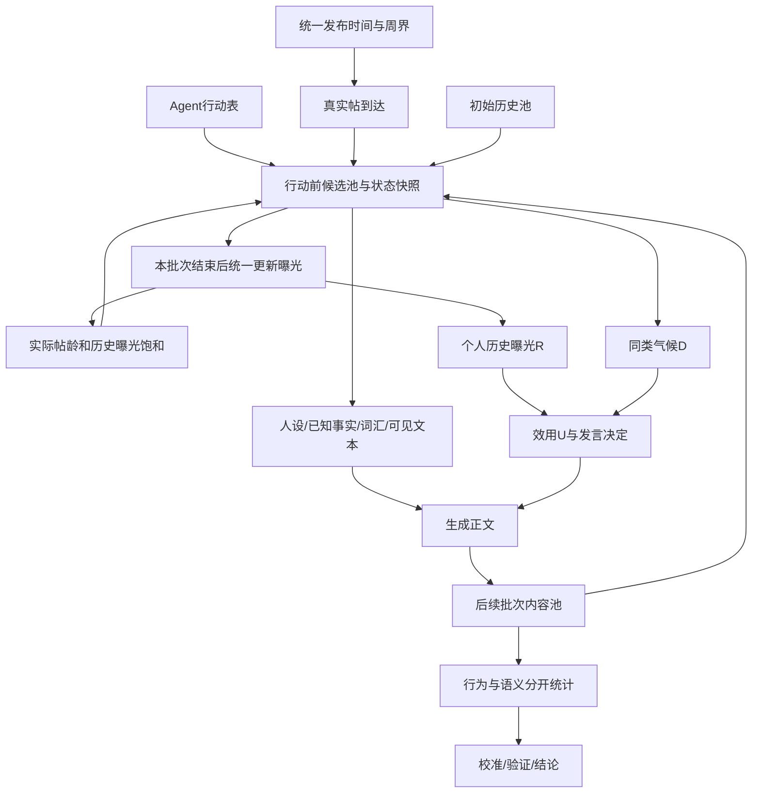

# 真实帖子到达机制：连锁影响审计

日期：2026-09-27。范围：静态代码检查及冻结输入审计；未修改仿真实现、正式配置、原始数据或流水线状态，未运行新仿真。用户选择“均衡：小规模诊断→核心对照→关键稳健性”。

配套：[实验方案](../EXPERIMENT_PLAN.md)、[复现脚本](audit_inputs.py)、[机器可读输入审计](input_audit.json)。脚本仅读源文件，不导入有写文件副作用的 `config_params.py`。输入哈希在 JSON 中。

## 1. 已确认的事实

| 编号 | 事实与证据 | 对改造的直接含义 |
|---|---|---|
| F01 | `_open_tick`（`custom/envs/curation_dynamics_space.py:860`）先注入整周样本，再为所有人装配 feed；Agent 帖在 `step` 收尾后才对后续周可见 | 到达时间、行动时间、生成内容回流时间是三个变量，不能只改第一个 |
| F02 | 当前 chronological 是独立小时路径；Agent 的行动门控也由 `chronological_action_hour` 决定（agent:223、388）；run_batch:70 按 run_id 是否含 chronological 选步数 | 应将时钟调度从算法名称中解耦；否则只改 env 会导致某些人每小时行动或根本不行动 |
| F03 | 250=15×11+85，W13/W18 原池量比 6.6905，注入量比 1.9444 | 保底压平供给节律，不能把它当固定缩尺；小时化后内容空档更明显 |
| F04 | 三 seed 的“周×类型”注入配额完全相同；每周类型分层最大余数法（config_params:349） | 当前 seed 仅覆盖文本组内变化，未覆盖类型供给组成不确定性 |
| F05 | 原资产 52,716 条，488 条 UTC 周与上海周不一致；s0/s1/s2 样本各 6/1/2 条。build_assets:320 使用 UTC isocalendar，env:539 转上海时间 | 抽样、事件边界、周 replay、基准、校准必须统一时区；保留旧 UTC 基准，另建 v2 基准 |
| F06 | holdout 三样本均 165 条；s0 有 1 条发布时间≥上海 W19 起点（2026-05-04 00:00+08），其余两份为 0 | 按旧 `week < W19` 过滤不足以定义本地时间截止；新方案使用 timestamp 严格切分 |
| F07 | 现有固定行动表：100 人、63 个非空小时/周、693 批次；每人每周重复同一小时，三个 seed 共用 | 会固定谁先行动、谁能被更多后续人看到；主方案采用每 agent×week 预抽时刻、seed 内跨臂配对 |
| F08 | 用现有行动表，仅计算已到达的外部真实帖：W12 在首次外部到达前行动的人数 s0/s1/s2=13/26/26；已到达外部帖不足10条对应74/79/58人 | 这些是外部供给支持度，不是实际空 feed 或实际总候选池测量；Agent 帖可能填补。需要初始池与空 feed 明确规则 |
| F09 | 既有行动表中26人行动早于配置事件周周二15:50，30人早于官方帖约定周二20:00；悼念型分别4/5人 | 周级全员事件刺激不再成立。事件时刻以配置为准；官方20:00是预登记约定，并非观测到的发布时间 |
| F10 | personas:47 预写“被其离世触动”；agent:104 的悼念生成指令直接要求离世感慨；profile 在首次曝光前已给常用词 | 需要审计背景知识与生成指令的可用时间，而不只过滤帖子 |
| F11 | 冻结 profile 中含“巧乐兹”词的agent有9人、“雪碧”7人、“跑不过”11人、“张雪峰死了”1人 | 证明词在初始 profile 中，不等于每次出现都构成未来知识；需核查上下文和可用来源。不能声称关闭晚期注入就已无晚期知识 |
| F12 | `_content_messages` 仍把本周 stock/flow 写给 LLM（agent:359），但数值 U 不读 B/S/G | “不进入数值决策”不等于“不影响生成”；全文生成→倾向分→后续推荐存在路径 |
| F13 | D 使用全部 feed 的类型分布，而 LLM 默认只读前5条、每条120字（agent:344） | 数值感知与文本可见内容不一致；排序顺序会通过前缀截断额外影响生成 |
| F14 | R 用历史累计同类曝光，当前 feed 曝光在该行动结束后加入累计；没有按墙钟时间恢复（agent:301、env:1414） | 不能每小时衰减 R，不能把“没看帖的时间”当作疲劳或恢复；当前/历史曝光边界需冻结 |
| F15 | interest 打分读取每帖累计曝光；`_open_tick` 在逐个 Agent 装配 feed 后立即计曝光（env:931） | 当前 sorted id 顺序已影响后续人的兴趣候选分数。复制此循环至小时批次，会破坏“共享批次前状态”的强定义；需先全批装配，再统一计账 |
| F16 | 帖子 life 半衰期1.5周，floor=.35；精确时间达到阈值约15.903天 | 原离散周退场与连续15.9天退场不是同一机制。转换时应列为显式因素，不能宣称完全只改注入 |
| F17 | create_post 锁内分配递增 pid（env:1268）；chrono 平票使用 pid | LLM 返回先后可能影响同时间帖子排序；锁保证唯一性，不保证科学意义上的次序不变 |
| F18 | `_start_chronological_week` 预统计整周计划数量；`_inject_chronological_until` 又按 rec.week 计当周id（env:1318、1364） | 计划数量与实际到达数量要分列；UTC周/本地周混用会造成已到达与周统计不一致 |
| F19 | 周 `feed_live_pool` 来自最后批次的标量；`_agent_rows` 多字段来自周末 env；checkpoint 未保存 `_exposure_age_buckets`（env:1593起） | 新版要记录行动时快照，再汇总；重启后年龄曝光等统计需可恢复，不能仅验证帖子总数 |
| F20 | create_post 返回 fail/error 不一定抛异常；agent 调用后直接 posted=True（agent:456） | 必须区分决定发言、生成成功、发布确认；时序错误导致的拒绝不能误记为真实沉默或已发帖 |
| F21 | 池中 Agent 帖 type=作者固定类型，assigned_type=正文独立判类，倾向分来自正文（env:965、1220） | 群体活跃、内部标签气候、语义内容构成是不同指标；不能用固定作者类型证明语义玩梗必然生成 |
| F22 | 数值代理生成帖用固定 `AGENT_TENDENCY_PROFILE[type]`，正式 env 读 LLM 文本倾向（calibrate_speak:327） | 共享 U 公式不代表代理与完整反馈同构；小时内反馈增加后，这种近似误差可能更大 |
| F23 | verify_experiment 的A层会导入并重写配置；其C5要求random/interest维持旧制，C7硬编码693及250；monitor、提取器也依赖旧命名 | 旧验证器不能不加区分地运行于v2；新检查应从独立manifest读期望值，避免重写旧产物 |
| F24 | 原资产 pid 无重复，精确非空正文的超额重复数2,576；时间戳重复的超额数1,717 | 不能直接把相同正文都删掉：转帖可能是真实传播。应区分抓取重复与真实重复发布，评估集按内容/作者簇隔离 |

## 2. 依赖链及风险

### 2.1 时间与更新制度

- 要同时区分 `published_at`（内容产生）、`available_at`（可推荐）、`acted_at`（人行动）、`week_start/week_end`（统计桶）。新真实帖可在发表后第一个行动批次被读取；Agent 帖同批互不可见，下一非空批次可见。周末最后一次行动之后的真实帖仍要入池并记在所属周，但未获当周曝光不构成异常。
- 一个行动批次必须冻结池、life、帖子累计曝光和个体历史量。先装配该批所有人的feed，再决定/生成，最后统一提交曝光和新帖。跨小时扩散存在，同小时不能借用LLM完成顺序形成扩散。
- 把周级11步改成小时级，不意味着每人每小时都行动。否则每人最多110条曝光会变成上万条，疲劳、生成量、费用与研究问题同时变了。
- 每周重抽行动时刻可能产生周日→周一的短间隔；固定每周同一时刻会固定先后位置。主方案仍属“每周一次行动机会”的模型，间隔分布应报告；个体稳定作息、多个浏览会话是扩展模型，不能悄悄加入。
- 历史“发帖时间”只为行动时间提供代理分布，并非真实登录/浏览分布；特别是事件引发的额外上线不在当前模型中。不能由W13早行动者较少悼念直接断言现实用户不知情。

### 2.2 空池、预热与边界

- v2从W12周一开始，初始库存只允许来自该时刻以前的帖子；历史库规模与抽样规则跨臂相同、单列预算。不能用W12晚些时候的帖子补足10条。
- 有效候选不足10条就返回实际条数；零条应显式记录“没有事件内容可供回应”，不依赖当前prompt的“自由发言”兜底。否则冷启动会产生无依据事件文本。
- 不足10条时，D分母使用实际条数会让1条同类帖等于100%气候，波动很大。主方案保留此已有规则并报告槽位数，低支持度会成为明确局限；平滑先验是单独的敏感性因素，不能为修复空池顺便调参。
- B是行为常态锚点，库存初始化不等于给个体虚构历史曝光。初始R累计量=0表示“模拟起点后暴露疲劳”；如要模拟事件前疲劳，必须有独立burn-in，消耗也要计入预算。
- 停止W19外部输入叠加约15.9天退场，会让最后一批W18真实帖在W21前后全部失去资格。若Agent产出也不足，池可能耗尽；再加“空feed不生产事件帖”的规则，就会进入无法自行恢复的空池状态。这种结果首先是供给与退场的联合后果，不能单独解释成兴趣机制失效。必须报告候选库存及首个耗尽时刻，并在代理层检查保留旧帖资格的对照。
- 官方发帖时间是可见性的下界，不是所有Agent获得事件知识的时刻。主实验通过可见帖子获得事件事实；共同新闻通知若要加入，必须三臂一致并作为另一个干预。

### 2.3 三种不同的因果问题

1. **时间处理效应**：仅改可见时间/调度后轨迹怎样变；需要桥接诊断，不能把全部v2改动之和称为注入时机效应。
2. **算法效应**：同样外部输入、群体、调度及候选资格下，推荐规则如何改变群体激活。兴趣臂还含衰减/饱和时，uniform random不是纯兴趣开关；需要去兴趣匹配的匹配控制。
3. **生成性/输入依赖**：停止W19以后新的外部帖，能否维持后段变化。这个干预同时减少数量、语义新颖性和话题素材；失败不等于“所有变化都是泄漏”，成功也不证明真实世界因果。

外部输入“同一日程”不要求演化后各臂池内容相同：Agent生产本来就是算法影响的一部分。若要测直接排序效应，可以把相同冻结候选快照送给多个算法做影子推荐；这只能测一步的直接曝光差异，不能替代闭环总效应。

### 2.4 数据与知识边界

- 类型分层抽样是可接受的条件回放设定，但不能据此宣称供给类型轨迹自主生成。统一概率抽样仍输入真实后段信息，需与停止后段输入的实验区分。
- 全窗人口比例19/22/23/15/21保留为既有情景设定；它并非严格事件前观测到的群体结构。只停止后段帖子，不能把整套系统改称真正样本外预测。
- W19–W22曾被反复查看，历史常量也曾依赖后段曲线诊断；新版本只能称“修订后的回顾性稳健性检验”。真正前瞻检验需新事件/未参与设计的时段或数据。
- 词表若仅作为固定测量/特征函数，对已可见文本打分，与把未来梗直接写入agent的生成词库是不同风险；但测量词表的事后设计同样限制前瞻声明。应保留完整来源及版本。
- 三平台合并数据属于合成内容环境。发帖时间、覆盖率、类型构成可能随平台变化；本轮不把平台拟人标签当作独立平台推荐系统。

### 2.5 统计、计算和结论

- 周数据点不是独立重复，100个Agent也不是100个独立实验。至少按完整外生seed配对比较；3个seed只能给探索性不确定性，不能靠11周×100人伪造大样本。
- 后段玩梗份额上升可能由其他类型退出造成；必须同时看绝对数、活跃人数和总分母。
- 现有候选逻辑未统一排除自己发过的帖子，应将自身帖/其他Agent帖/外部帖曝光分列。主方案先保留自帖资格且跨臂一致；取消自帖资格属于单独模型变化，不能静默混入时序修复。
- “曝光/供给”放大指标要对齐行动时刻的可推荐池。周五才到达的帖子本来就比周一帖子少曝光机会；应构造条件于每次行动候选池的随机曝光基准，避免用整周最终供给作分母。
- 新方案必须保留失败、空信息流、发布拒绝和重试记录。失败率若按臂/时间不同，会伪装成沉默机制。
- 调度主要增加引擎/存储开销，不必增加每人行动次数；LLM请求成功数仍随发言率变化，重试和工具路由开销另计。运行时间需实测，不能由693/11直接倍乘LLM费用。

## 3. 对结果方向的可证伪预期

| 改动 | 较确定的规则后果 | 待验证的行为结果 |
|---|---|---|
| 截止时刻过滤 | 不可再由尚未到达的帖子直接触发阅读 | W13峰可能下降或后移，但周内反馈可补偿 |
| 同周Agent回流 | 后行动者可接触先行动者的帖 | 可能增强早到话题，不只增强玩梗；也可能增加疲劳后抑制尾部 |
| 原周保底取消 | 供给不再被强制托底 | 低谷可能加深，也可能因历史库存/Agent帖维持而不变 |
| 连续帖龄 | 老化不再只发生于周界 | 当前floor对应15.9天退场，可能改变历史内容竞争；方向依类型发布时间分布而定 |
| 全批快照统一计曝光 | Agent遍历顺序不再机械改变同批得分 | 可能改变同温层强度和曝光集中度，不能预设“更平均” |
| 关闭晚期强制词汇 | 不再由profile直接提示那些梗 | 晚期玩梗可能减弱；LLM先验、已见素材仍可能产生相关表达 |
| W19后停止真实到达 | 没有新晚期真实帖作为驱动 | 变化消失说明依赖持续供给；留下变化只支持本模型可维持，并非现实机制证明 |

## 4. 文档冲突和当前状态

`PARAMETERS.md`、部分注释与manifest仍把chronological描述为有生命周期/置顶，与执行路径不一致。本审计以可执行分支与冻结配置优先，不据旧文字下结论。

流水线当前为revision_round=6、experiment_config needs_revision。其reroute原因保留了9月25日的标注器结论；9月27日 `results/labeler_sensitivity/REPORT.md` 已补同R1口径对照，interest与random在该口径下均值非常接近（23.12 vs 23.15）。因此方案要求冻结标注口径并做敏感性，不把“换模型必然翻转”当当前事实。本次不擅自修改历史reroute记录。

方法参考：[ODD协议对初始化、输入与更新顺序的要求](https://www.jasss.org/23/2/7.html)、[调度对舆论模型结果的影响](https://www.jasss.org/22/4/5.html)、[ABM输出分析与随机性](https://www.jasss.org/18/4/4.html)。这些文献支持审计框架，不为本模型的结果方向提供实证保证。
